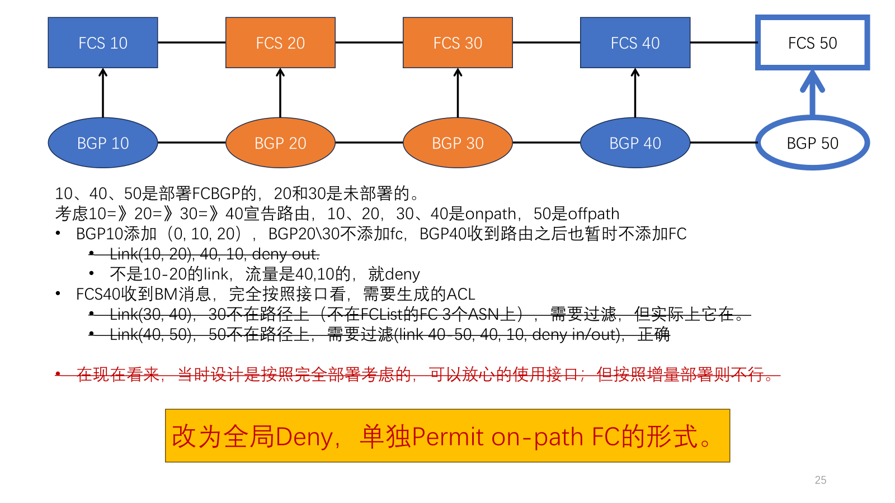
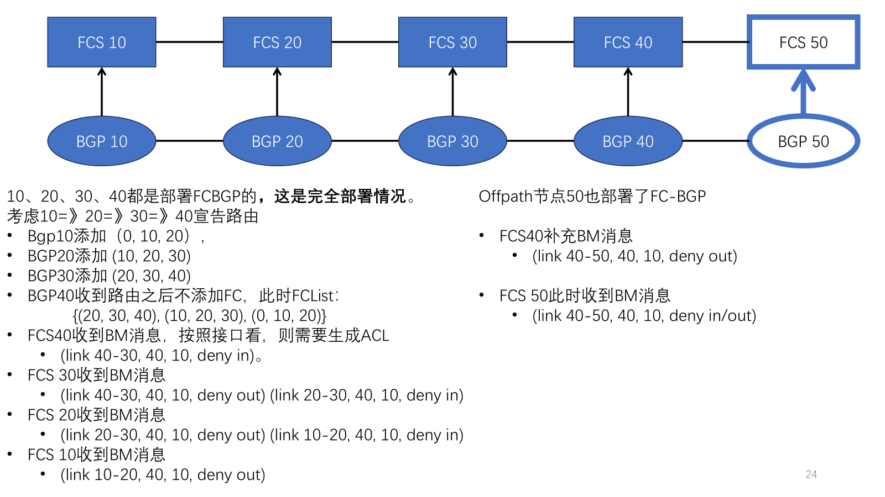

# h3c-netconf-deny-traffic-globaly-and-permit-one.cn

> **Author** Basil Guo
>
> **Date** Sep. 14, 2024
>
> **Description** 分析 h3c 的 ACL 下发

[TOC]

在 FC-BGP 中，流量应该是对应着路由传播方向，即便是在部分部署时，也是一样的。



以上边的图为例，10、40、50 部署了 FC-BGP，20、30 没有部署。

- 在 FCS 40 这里，由于没有 FC，但是它是起点， from bgp 的，所以它什么也不做（如果要做，也是 deny <40, 10>，然后放开 link 30-40 的 out）；
- 在 FCS 10 这里，需要先全局 deny <40, 10>的流量，只放开 link 10-20 的 in；
- 在 FCS 50 这里，由于没有 FC，且 offpath，所以它 deny <40, 10>。



在上边的图上，10、20、30、40、50 都部署了 FC-BGP。FCList({20, 30, 40}, {10, 20, 30}, {0, 10, 20})。

- 在 FCS 40，虽然它在路径上，但是 FC 不是它生成的，它可以不管了，要是生成 ACL，也是 deny <40, 10>, permit link 30-40 out。
- 在 FCS 50，deny <40, 10>。
- 在 FCS 30，deny <40, 10>, permit link 30-40 in, permit link 20-30 out。
- 在 FCS 20，deny <40, 10>, permit link 20-30 in, permit link 10-20 out。
- 在 FCS 10，deny <40, 10>, permit link 10-20 in。

假设都部署了，

```txt
10-20-30-40-50
```

1. 路由宣告路径：20=>30, FCList{(0, 20, 30)}
   - FCS 30, onpath, deny <30, 20>, permit link 20-30 out
   - FCS 20, onpath, deny <30, 20>, permit link 20-30 in
   - FCS 10, offpath, deny <30, 20>
   - FCS 40, offpath, deny <30, 20>
   - FCS 50, offpath, deny <30, 20>
2. 路由宣告路径：20=>40, FCList{(0, 20, 30), (20, 30, 40)}
   - FCS 40, onpath, deny <40, 20>, permit link 30-40 out
   - FCS 30, onpath, deny <40, 20>, permit link 30-40 in, permit link 20-30 out
   - FCS 20, onpath, deny <40, 20>, permit link 20-30 in
   - FCS 10, offpath, deny <40, 20>
   - FCS 50, offpath, deny <40, 20>
3. 路由宣告路径：10=>50, FCList{(0, 10, 20), (10, 20, 30), (20, 30, 40), (30, 40, 50)}
   - FCS 50, onpath, deny <50, 10>, permit link 40-50 out
   - FCS 40, onpath, deny <50, 10>, permit link 40-50 in, permit link 30-40 out
   - FCS 30, onpath, deny <50, 10>, permit link 30-40 in, permit link 20-30 out
   - FCS 20, onpath, deny <50, 10>, permit link 20-30 in, permit link 10-20 out
   - FCS 10, onpath, deny <50, 10>, permit link 10-20 in
